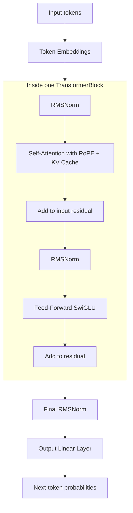
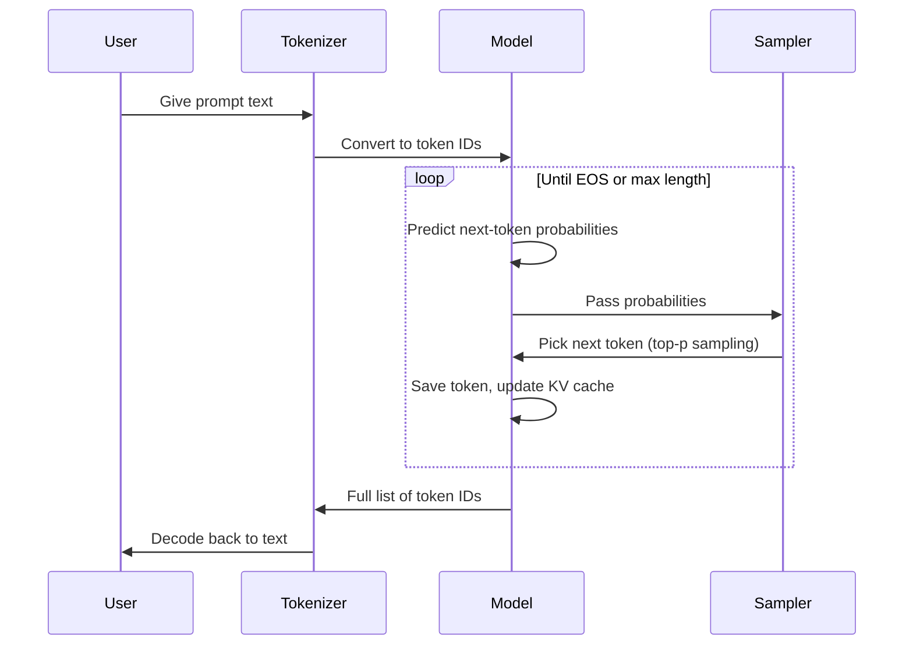
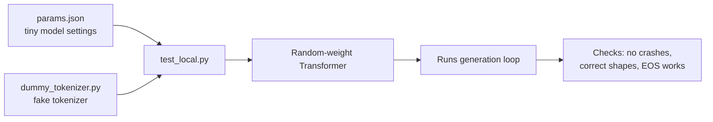

# LLaMA 2

A simple, from-scratch implementation of the LLaMA 2 architecture in PyTorch. It includes the model code, a text generation loop, and a way to test everything locally with a tiny random model.

## What's in this project

| File | What it does |
|---|---|
| `model.py` | The actual LLaMA architecture: attention, RoPE, RMSNorm, feed-forward, KV cache |
| `inference.py` | Loads a real LLaMA-2 checkpoint and runs text generation |
| `test_local.py` | Builds a tiny model with **random weights** and a **fake tokenizer**, so you can test the code without downloading anything |
| `dummy_tokenizer.py` | A fake, simple tokenizer used only for local testing |
| `params.json` | Settings for the tiny test model (size, number of layers, etc.) |

## How the model works

Each token passes through several `TransformerBlock` layers. Each block does two things: it lets the token "look at" other tokens (attention), then it processes the token on its own (feed-forward).



**Key ideas used in this model:**

- **RoPE (Rotary Position Embeddings):** instead of adding a "position number" to each token, it rotates the query and key vectors based on position. This helps the model understand word order.
- **KV Cache:** when generating text one token at a time, the model saves the keys and values from previous tokens so it doesn't have to recompute them every step. This makes generation much faster.
- **Grouped-Query Attention:** the number of "key/value" heads can be smaller than the number of "query" heads, to save memory. The `repeat_kv` function copies key/value heads so the numbers match up again.
- **SwiGLU Feed-Forward:** a variant of the normal feed-forward layer that tends to work a bit better in practice.

## How text generation works

Text is generated one token at a time. The model looks at the current token, predicts the next one, adds it to the sequence, and repeats — until it hits an end-of-sequence token or a length limit.



## Testing locally (no download needed)

Downloading the real LLaMA-2 weights takes a long time and a lot of disk space (~13GB). To just check that the code runs correctly, use the tiny test setup instead:



Run it with:

```bash
uv run python test_local.py
```

This builds a small model (a few layers, small hidden size) with **random weights**, so the generated text won't make sense — that's expected. The point is only to check that the code runs correctly end-to-end: attention, RoPE, KV cache, feed-forward, and the sampling loop.

## Running with the real model

Once you're confident the code works, use `inference.py` with a real downloaded LLaMA-2 checkpoint:

```bash
python inference.py
```

This expects:
- A folder with the real `.pth` checkpoint file and `params.json`
- A real `tokenizer.model` file (SentencePiece tokenizer)

## Requirements

- Python 3.11+
- PyTorch
- sentencepiece (only needed for real inference, not for the local test)
- tqdm